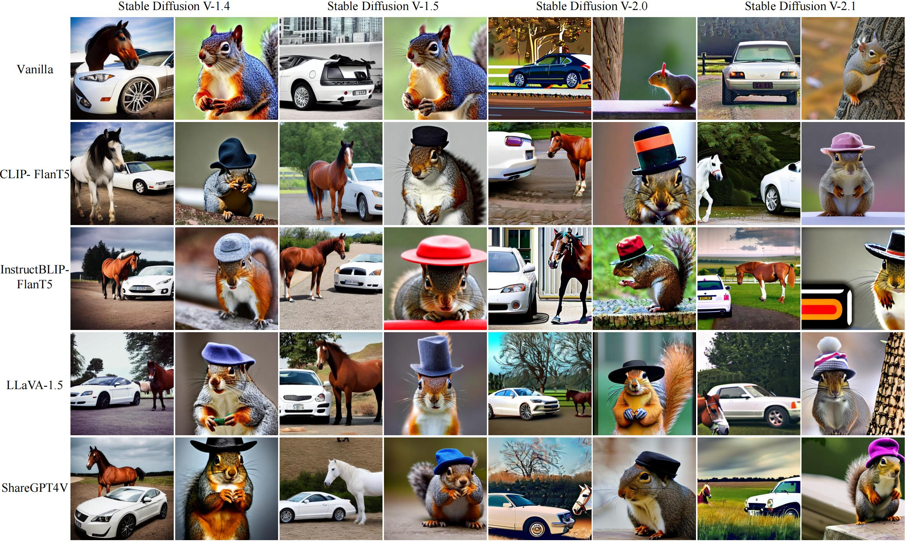
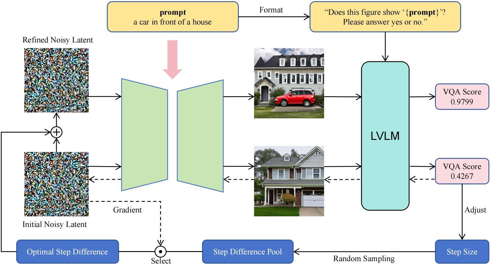

# Noise Diffusion for Enhancing Semantic Faithfulness in Text-to-Image Synthesis (CVPR 2025)
Official PyTorch code release for the paper: https://arxiv.org/abs/2411.16503


**Abstract:** Diffusion models have achieved impressive success in generating photorealistic images, but challenges remain in ensuring precise semantic alignment with input prompts. Optimizing the initial noisy latent offers a more efficient alternative to modifying model architectures or prompt engineering for improving semantic alignment. A latest approach, InitNo, refines the initial noisy latent by leveraging attention maps; however, these maps capture only limited information, and the effectiveness of InitNo is highly dependent on the initial starting point, as it tends to converge on a local optimum near this point. To this end, this paper proposes leveraging the language comprehension capabilities of large vision-language models (LVLMs) to guide the optimization of the initial noisy latent, and introduces the Noise Diffusion process, which updates the noisy latent to generate semantically faithful images while preserving distribution consistency. Furthermore, we provide a theoretical analysis of the condition under which the update improves semantic faithfulness. Experimental results demonstrate the effectiveness and adaptability of our framework, consistently enhancing semantic alignment across various diffusion models. 

**Framework Overview**


## Run
### Environment Setup
```bash
conda create -n nd python=3.10
conda activate nd
pip install -r requirements.txt
```
### Requirement
- You need at least one NVIDIA RTX A6000 (48GB) GPU to reproduce the results.

### Demo
Stable Diffusion models can be downloaded from Hugging Face automatically. Run the following command to generate images.
```bash
python run_sd.py 
```
For more advanced diffusion models such as Stable Diffusion 3, run the following command:
```bash
python run_sd3.py
````

### Datasets
To reproduce the quantitative results, you can run the script on the datasets:
- [simple_cases.json](datasets/simple_cases.json): Dataset for simple cases.
- [complex_cases.json](datasets/complex_cases.json): Dataset for complex cases.

## Citation
If you find this repository useful, please cite our paper:
```
@inproceedings{miao2025noise,
  title={Noise Diffusion for Enhancing Semantic Faithfulness in Text-to-Image Synthesis},
  author={Miao, Boming and Li, Chunxiao and Wang, Xiaoxiao and Zhang, Andi and Sun, Rui and Wang, Zizhe and Zhu, Yao},
  booktitle={Proceedings of the Computer Vision and Pattern Recognition Conference},
  pages={23575--23584},
  year={2025}
}
```
We would really appreciate it if you could give a star to this repository.
## Acknowledgements
Special thanks to the [t2v_metrics](https://github.com/linzhiqiu/t2v_metrics) repository for providing the base large vision-language models used in our project.
